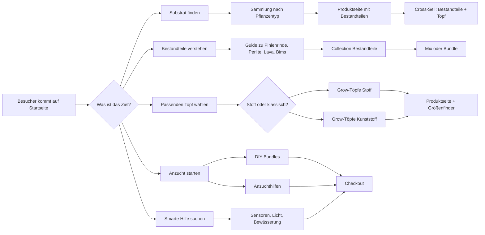
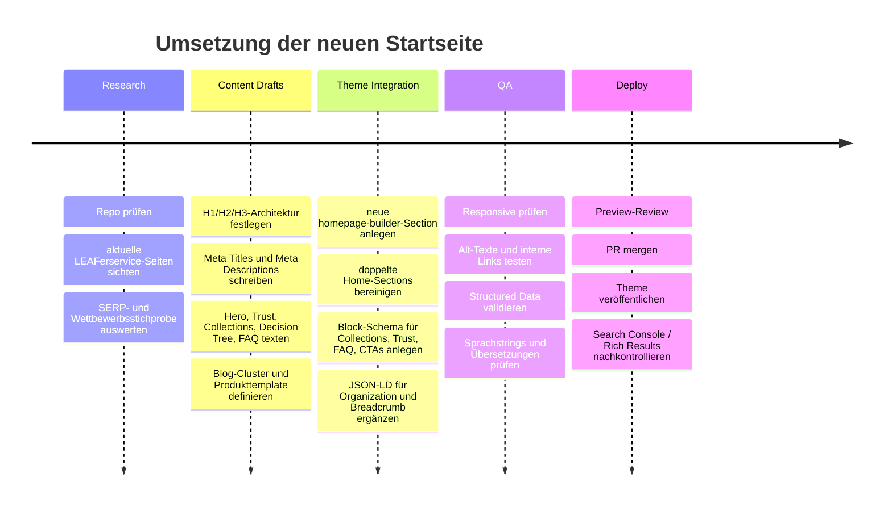

# SEO- und Content-Blueprint für die neue Shopify-Startseite von LEAFerservice

> Forschungsstand vom 14.09.2026. Die ursprünglichen Chat-internen
> Quellenmarker wurden für die GitHub-Version entfernt; konkrete Aussagen,
> Marktbeispiele und externe Empfehlungen vor einer Veröffentlichung erneut
> gegen die Originalquellen prüfen.

## Executive Summary

Auf Basis deiner Zielsetzung, der vorhandenen Theme-Struktur im Repository `davidnoehmke/leaferpage` und der öffentlich sichtbaren LEAFerservice-Seiten ist die richtige Lösung **keine weitere Einzel-Section**, sondern ein **modulares Homepage-System** mit sauberer Informationsarchitektur, klarer Suchintent-Abdeckung und editorfreundlicher Pflege über Section-Schema statt hart codierter Texte. Das Repository ist bereits als Shopify Online Store 2.0 Theme angelegt, enthält viele thematisch passende Sections und unterstützt auf Produkt- und Artikelebene bereits strukturierte Daten, aber die Startseite ist im aktuellen Template noch sehr schlank konfiguriert und die globale Theme-Konfiguration ist praktisch leer.

Die Suchlandschaft zeigt, dass im deutschsprachigen Markt vor allem drei Muster gut funktionieren: **ausführliche Ratgeber mit Inhaltsverzeichnis und Problemlogik**, **produktnahe Kategorie- und Produktseiten mit klar erklärten Bestandteilen/Vorteilen**, sowie **vertrauensstarke Shop-Seiten mit Versand-, Zahlungs- und Materialhinweisen**. Besonders sichtbar sind Seiten wie der umfangreiche Substrat-Guide von Foliage Factory, die pflanzenspezifischen Substrat- und Anzucht-Seiten von Pflanzpaket, die struktur- und datenstarken Produktseiten von MG Plants und die Stofftopf-Kategorien von Growmart bzw. Herstellerseiten wie Gronest.

Für LEAFerservice ergibt sich daraus eine klare SEO- und Conversion-Strategie: **ruhige, verständliche und fachkundige Texte**, die zuerst Orientierung geben; **moderne, modular verschiebbare Blöcke**; **klare Trennung der Kernkollektionen**; **eine Buyer-Journey als Entscheidungshilfe**; **sichtbare Trust-Signale**; **interne Verlinkung zwischen Startseite, Kategorieseiten, Wissensseiten und Produkten**; sowie **ergänzende JSON-LD-Auszeichnung für Organization, Breadcrumb und sichtbare FAQs**, während Produkt-Structured-Data im Theme bereits vorhanden ist. Google empfiehlt informative Titel und Überschriften, hilfreiche Meta Descriptions, kontextbezogene Alt-Texte, crawlbare Links und sichtbarkeitskonforme strukturierte Daten; für E-Commerce ist JSON-LD das bevorzugte Format.

Bemerkenswert ist außerdem: Die aktuelle LEAFerservice-Präsenz hat bereits starke Themenanker rund um Substrate, Bestandteile, Pflanzgefäße, Konfigurator und FAQ, aber die Google-Snippets zeigen auch **Content-Hygiene-Probleme** wie Sprachmischung und „Translation missing“-Strings. Genau diese Punkte sollte die neue Startseite nicht nur optisch, sondern auch technisch bereinigen.

## Ausgangslage, Markenstimme und Repo-Befund

Deine bereitgestellte Brand-&-Voice-Datei beschreibt eine Marke, die **ruhig, natürlich, persönlich, fachkundig und nutzenorientiert** wirkt. Genau daraus folgt für die SEO-Texte ein klarer Stil: kurze Hauptsätze, verständliche Erklärungen, Nutzen vor Technik, keine künstliche Dringlichkeit, keine unbelegten Heilsversprechen und keine marktschreierischen Superlative. Diese Tonalität passt sehr gut zu den Suchmustern im Segment „Zimmerpflanzen / Indoor Growing / Substrate / Anzucht“, weil die besten sichtbaren Inhalte im Markt ebenfalls stark erklärend und problemlösend aufgebaut sind.

Im Repository liegen bereits viele passende Bausteine vor: unter `sections/` gibt es unter anderem `hero.liquid`, `leaf-home.liquid`, `home-collection-journey.liquid`, `trust-bar.liquid`, `faq.liquid`, `category-grid.liquid`, `brand-story.liquid`, `starter-showcase.liquid` und weitere Home-/Content-nahe Sections. Gleichzeitig ist das aktuelle Homepage-Template `templates/index.json` im Repository nur mit einer einzigen Section vom Typ `leaf-home` belegt. Das spricht stark dafür, die vorhandenen Ideen in **eine** finale, saubere Startseitenarchitektur zu konsolidieren, statt parallele oder doppelte Home-Sections weiterzuführen.

Technisch ist das Theme bereits SEO-fähig, aber noch nicht vollständig ausgereizt. Das Theme rendert in `theme.liquid` bereits `product | structured_data` und `article | structured_data`, also Shopify-Structured-Data für Produkte und Artikel. Shopify dokumentiert, dass der `structured_data`-Filter für Produktobjekte ein `Product` bzw. bei Varianten eine `ProductGroup` ausgeben kann. Was im aktuellen Repo dagegen noch fehlt, sind konsistente Ergänzungen für **Organization-Markup auf Startseite/Über-uns-Seite**, **BreadcrumbList** für Collections/Produkte/Blog und saubere **FAQPage-/FAQ-Auszeichnung nur dort, wo Fragen sichtbar auf der Seite stehen**.

Auffällig ist auch: `config/settings_schema.json` ist im Repository leer. Das heißt nicht, dass der Theme Editor unbrauchbar wäre, aber es bedeutet, dass zentrale globale Theme-Einstellungen aktuell kaum genutzt werden. Für dein Ziel „alles in config Datei anpassbar“ ist deshalb die sauberste Lösung, die neue Startseite primär über **Section-Settings und Block-Settings** zu steuern und nur wirklich globale Dinge – etwa Markenfarben, Radius, Shadow-Level, Container-Breiten oder Badge-Stile – ins globale Settings-Schema zu ziehen.

### Wettbewerbsbild und Content-Gaps

| Beobachtung im Markt | Sichtbare Beispiele | Was dort gut funktioniert | Konkrete Lücke für LEAFerservice |
|---|---|---|---|
| Lange Ratgeber ranken für generische Learn-Intents | Foliage Factory, Pflanzpaket | Inhaltsverzeichnis, Problem-Lösungs-Logik, Zutaten-Erklärungen, FAQ, Vergleichstabellen. | Auf der Startseite fehlt noch ein starker „Orientierungsblock“, der Anfänger und Fortgeschrittene direkt in passende Kollektionen oder Guides führt. |
| Produktseiten mit Material- und Datenangaben bauen Vertrauen auf | MG Plants, Greensoils | Zusammensetzung, pH/EC, Größenlogik, Versandhinweise, Anwendungsbereiche, Cross-Sells. | Produktseiten sollten konsequent mit „Für wen / wann sinnvoll / Bestandteile / Anwendung / Was passt dazu“ aufgebaut werden. |
| Stofftopf-Seiten gewinnen über klare Nutzenargumente | Growmart, Gronest, GBK | Air-Pruning/Luftbeschneidung, weniger Ringwurzeln, Größen, Material, Einsatzgebiet. | „Grow-Töpfe Stoff“ und „Grow-Töpfe Kunststoff“ sollten separat als Collection-Layer und SEO-Landingpages geführt werden. |
| Anzucht- und Starterwelten funktionieren besser als reine Produktlisten | Pflanzpaket, BAUHAUS, Growland | Einfache Anzuchtpfade, Set-Denke, klare Startvorteile, Hilfe beim Einstieg. | DIY Bundles und Anzuchthilfen verdienen eigene Entry-Points mit Lern- und Kaufintention zusammen. |
| Herstellerseiten bieten harte Vertrauensanker | LECHUZA, Gronest, FYTA, GARDENA | Bewässerungssystem, Luftbeschneidung, Messsensorik, Material-/Fertigungsdetails. | Solche Merkmale sollten in Produkt-Benefit-Blöcken präzise und ohne Übertreibung gespiegelt werden. |

## Suchlandschaft, Informationsarchitektur und SEO-Strategie

Die beste Startseitenlogik für LEAFerservice ist **nicht „erst Marke, dann alles andere“**, sondern **„erst Bedarf, dann passende Lösung“**. Das entspricht sowohl deiner Markenstimme als auch dem Suchverhalten: Menschen suchen nach „Aroid Substrat“, „Stofftopf“, „Substratbestandteile“, „Anzuchterde Stecklinge“ oder „welches Substrat für Monstera“, also nach **Problemen, Pflanzen und Einsatzzwecken**, nicht nach abstrakten Sortimentskategorien. Genau deshalb funktionieren Problemeinstiege, Inhaltsverzeichnisse, Vergleichsblöcke und „passt für“-Hinweise bei den sichtbaren Wettbewerbern so gut.

Für Google und Nutzer ist außerdem wichtig, dass Seiten **klare, informative Titel und Überschriften** haben. Google weist explizit darauf hin, dass Titellinks aus dem `title`-Element, aber auch aus Überschriften und prominentem Text auf der Seite abgeleitet werden können. Meta Descriptions haben keine feste Zeichenbegrenzung, sollen aber einen präzisen und überzeugenden Überblick über die Seite geben. Interne Links sollten crawlbar sein und beschreibenden Anchor-Text nutzen; Google nennt außerdem eine logische Seitenstruktur und die Verlinkung wichtiger Seiten von relevanten Seiten aus als Best Practice für bessere Navigation und Sitelinks.

Für Bilder gilt: Google betrachtet den Alt-Text als wichtigsten Metadatenpunkt für Bilder; guter Alt-Text ist kurz, kontextbezogen und beschreibt nicht „das Bild an sich“, sondern die Rolle des Bildes im jeweiligen Seitenkontext. Für dein Theme heißt das: keine generischen Alt-Texte wie „Produktbild 1“, sondern kontextreiche Formulierungen wie „Gronest Stofftopf 11 Liter auf hellem Untergrund“ oder „Substratbestandteile Pinienrinde, Perlite und Bims im Überblick“.

Strukturierte Daten sollten ausschließlich sichtbare Inhalte beschreiben; Google empfiehlt JSON-LD als Format. Für LEAFerservice ist die Priorität klar:  
- **Organization** auf Startseite oder Über-uns-Seite, nicht zwingend auf jeder Seite.  
- **BreadcrumbList** auf Collection-, Produkt- und Blogseiten.  
- **Product / ProductGroup** weiter über Shopify laufen lassen.  
- **FAQPage** nur dort, wo die Fragen tatsächlich sichtbar sind – und ohne Erwartung, dass Google für einen Shop automatisch FAQ-Rich-Results zeigt, da diese laut Google derzeit nur noch für behördliche oder gesundheitsbezogene, autoritative Seiten als Rich Result vorgesehen sind.

### Empfohlene Buyer-Journey



Diese Journey bildet exakt das ab, was im Markt sichtbar erfolgreich ist: Top-of-Funnel-Orientierung, Mid-Funnel-Vergleich und Bottom-Funnel-Kaufhilfe in einem durchgängigen System. Gleichzeitig passt das zu deiner bestehenden Themenwelt aus Startseite, Substratbestandteilen, Pflanzgefäßen, Konfigurator und Produktdetailseiten.

## SEO-Content-Plan und Templates

### SEO-Content-Plan pro Seite und Sektion

Die folgende Planung kombiniert Suchintent, Conversion und Theme-Editor-Logik. Die URL-Pfade sind als **empfohlene Handles** zu verstehen. Für URLs empfiehlt Google eine einfache, verständliche Struktur; für Titel und Überschriften informative, knappe Formulierungen.

| URL / Sektion | H1 | Empfohlene H2s | Target Keywords | Meta Title | Meta Description | Primary CTA | Schema Types |
|---|---|---|---|---|---|---|---|
| `/` | Pflanzenpflege beginnt an der Wurzel | Warum LEAFerservice wirkt; Kollektionen nach Bedarf; Finde dein passendes Setup; Häufige Fragen; Aus dem Blog | pflanzsubstrat, aroid substrat, stofftopf, grow topf, anzuchthilfe, zimmerpflanzen substrat | LEAFerservice – Substrate, Bestandteile, Grow-Töpfe & smarte Grow Hilfen | Finde Substrate, Bestandteile, Grow-Töpfe, DIY Bundles, Anzuchthilfen und smarte Grow Hilfen – verständlich erklärt und passend zu deinem Projekt. | Sortiment entdecken | `Organization`, `BreadcrumbList`, sichtbare FAQ als `FAQPage` |
| `/collections/substrate` | Substrate für Indoor Growing und Zimmerpflanzen | Welches Substrat passt zu welcher Pflanze; So unterscheiden sich unsere Mischungen; Wann fertige Mischungen sinnvoll sind; Passende Ergänzungen | substrate, zimmerpflanzen substrat, aroid substrat, monstera substrat, anzuchterde | Substrate für Zimmerpflanzen & Indoor Growing | Strukturstabile Mischungen für Aroids, Anzucht, Kräuter, Kakteen und mehr. Finde das passende Substrat für Wurzeln, Wasserführung und Alltag. | Substrat wählen | `BreadcrumbList`, Collection-Visible FAQ |
| `/collections/bestandteile` | Substrat-Bestandteile gezielt auswählen | Was jeder Bestandteil im Topf verändert; Luft, Drainage, Feuchte, Struktur; Häufige Mischziele; Passende Kombinationen | substratbestandteile, perlite, pinienrinde, bims, lava, blähton | Substrat-Bestandteile verstehen und kaufen | Perlite, Pinienrinde, Lava, Bims, Blähton und mehr: verständlich erklärt und passend für deinen Mix ausgewählt. | Bestandteile ansehen | `BreadcrumbList`, sichtbare FAQ |
| `/collections/grow-toepfe-stoff` | Grow-Töpfe aus Stoff für starke Wurzeln | Warum Stofftöpfe anders funktionieren; Welche Größe passt; Für wen Stofftöpfe sinnvoll sind; Pflege und Einsatz im Alltag | stofftopf, grow topf stoff, pflanzsack, atmungsaktiver topf | Stofftöpfe für Indoor Growing & Zimmerpflanzen | Atmungsaktive Stofftöpfe für bessere Belüftung, saubere Wasserführung und starke Wurzeln. Größen, Einsatz und Vorteile im Überblick. | Stofftöpfe entdecken | `BreadcrumbList`, FAQ |
| `/collections/grow-toepfe-kunststoff` | Klassische Grow-Töpfe und Pflanzgefäße | Wann klassische Töpfe sinnvoll sind; Bewässerungssysteme und Einsätze; Größenwahl; Passendes Substrat dazu | pflanzgefäß, grow topf kunststoff, selbstbewässerung topf, lechuza topf | Pflanzgefäße & klassische Grow-Töpfe | Finde klassische Pflanzgefäße und Systeme mit Bewässerungseinsatz – passend zu Substrat, Standort und Pflegeaufwand. | Pflanzgefäße entdecken | `BreadcrumbList`, FAQ |
| `/collections/diy-bundles` | DIY Bundles für einen einfachen Start | Für wen Bundles sinnvoll sind; Typische Starter-Sets; Was im Bundle enthalten ist; So wählst du das richtige Bundle | diy bundle pflanzen, starter set pflanzen, pflanzen bundle | DIY Bundles für Anzucht, Umtopfen und Pflege | Sinnvoll kombinierte Sets für einen einfachen Start: abgestimmte Produkte statt unübersichtlicher Einzelwahl. | Bundle finden | `BreadcrumbList`, FAQ |
| `/collections/anzuchthilfen` | Anzuchthilfen für Aussaat und Stecklinge | Der saubere Start für Jungpflanzen; Medien, Tools und Hilfen; Häufige Fehler bei der Anzucht; Was danach wichtig ist | anzuchthilfe, anzuchterde, stecklinge substrat, aussaaterde | Anzuchthilfen für Aussaat und Stecklinge | Finde Anzuchthilfen, Medien und praktische Tools für einen kontrollierten Start bei Aussaat, Stecklingen und Jungpflanzen. | Anzucht starten | `BreadcrumbList`, FAQ |
| `/collections/smarte-grow-hilfen` | Smarte Grow Hilfen für mehr Überblick | Sensoren, Licht und Bewässerung; Wann smarte Helfer sinnvoll sind; Für Anfänger vs. Profis; So kombinierst du Technik mit Substrat | smarte grow hilfen, pflanzensensor, grow light, bewässerung sensor | Smarte Grow Hilfen für Licht, Sensorik und Bewässerung | Sensoren, Licht und smarte Helfer für Zimmerpflanzen und Indoor-Projekte – verständlich erklärt und passend ausgewählt. | Smarte Helfer entdecken | `BreadcrumbList`, FAQ |
| `/pages/leafers-substratbestandteile` | Substratbestandteile verstehen | Warum Bestandteile wichtig sind; Was Pinienrinde, Perlite, Lava & Co. tun; Welche Mischung zu welcher Pflanze passt; Häufige Fragen | substratbestandteile verstehen, pinienrinde perlite lava blähton | Substratbestandteile verstehen – LEAFerservice | Lerne, wie Bestandteile Luft, Struktur, Drainage und Feuchtigkeit im Topf beeinflussen – verständlich, praxisnah und ohne Fachkauderwelsch. | Passende Bestandteile finden | `BreadcrumbList`, FAQ |
| `/blogs/leafers-nice2know-blog` | LEAFers nice2know | Substrat wählen; Umtopfen; Töpfe und Bewässerung; Anzucht; Smart Grow | zimmerpflanzen blog, substrat ratgeber, stofftopf ratgeber | Blog für Substrate, Töpfe, Anzucht und Pflanzenpflege | Praxisnahe Ratgeber zu Substrat, Bestandteilen, Töpfen, Anzucht und smarten Helfern – verständlich erklärt und direkt anwendbar. | Zum Blog | `BreadcrumbList`, `Blog`, `CollectionPage`-ähnliche Struktur über Shopify |
| `/products/[handle]` | `[Produktname]` | Für wen das Produkt sinnvoll ist; Material/Bestandteile; Anwendung; Größen & Varianten; Passende Ergänzungen | produktspezifisch, z. B. aroid substrat, stofftopf 11l, perlite kaufen | `[Produktname]` – LEAFerservice | Klar erklärte Produktseite mit Material-/Bestandteile-Infos, Anwendung, Größen und passenden Ergänzungen für dein Setup. | In den Warenkorb | Shopify `Product` / `ProductGroup`, plus `BreadcrumbList` |

**Warum diese Struktur funktioniert:** Sie deckt die sichtbaren Markt-Muster ab – Guide-Content für generische Suchanfragen, klare Kategorieseiten für transaktionale Begriffe, produktnahe Trust-Elemente für Conversion und eine interne Linkstruktur, die wichtige Seiten von relevanten Seiten aus anbindet. Genau das empfiehlt Google für Verständlichkeit, Crawlability und eine bessere Navigationsqualität.

### Blog-Topic-Cluster

Die Cluster sind so gewählt, dass sie sowohl generische Ratgeber-Intents als auch direkte Shopping-Intents abholen. Sie schließen außerdem Lücken zwischen deinem bestehenden Wissensbereich und den kaufnahen Kategorien. Die deutlich sichtbaren Wettbewerber zeigen, dass besonders Kombinationen aus **Erklärung + Vergleich + konkrete Produktempfehlung** funktionieren.

| Topic | Search Intent | Target Keywords | Suggested Title | Intro 300–600 Wörter | Interne Links |
|---|---|---|---|---|---|
| Stofftopf vs. klassischer Topf | Commercial Investigation / Informational | stofftopf oder plastiktopf, stofftopf vorteile, grow topf | Stofftopf oder klassischer Topf – was ist für deine Pflanze sinnvoller? | Viele Pflanzenprobleme wirken auf den ersten Blick wie ein Gießfehler, sind aber in Wahrheit ein Topfproblem. Wenn Wasser zu lange im Gefäß steht, die Erde langsam verdichtet oder Wurzeln kreisförmig an der Innenwand entlangwachsen, wird die Pflege schnell unberechenbar. Genau deshalb lohnt sich der Blick auf die Frage, die oft zu spät gestellt wird: Braucht deine Pflanze wirklich einen klassischen Topf – oder wäre ein Stofftopf die bessere Wahl? Stofftöpfe werden im Markt meist mit besserer Belüftung, schnellerer Abtrocknung und stärkerer Wurzelverzweigung begründet. Hersteller wie Gronest sprechen von Luftbeschneidung, Growmart beschreibt den Gegenpol dazu als Drehwurzel-Effekt in festen Topfwänden. Gleichzeitig sind klassische Pflanzgefäße nicht automatisch schlechter. Systeme wie LECHUZA oder self-watering Inserts von elho zielen gerade darauf, Wasser kontrollierter bereitzustellen und den Pflegeaufwand zu senken. Für Pflanzenhalter ist deshalb nicht die pauschale Frage entscheidend, welcher Topf „besser“ ist, sondern unter welchen Bedingungen welcher Topf sinnvoller wird. Wenn du eher zu viel gießt, wenig Zeit hast oder deine Pflanzen in einem schwer abtrocknenden Raum stehen, können Stofftöpfe ein guter Hebel sein. Wenn du ein sehr aufgeräumtes Setup willst, mit Untersetzern, Einsätzen oder Reservoiren arbeitest und eine gleichmäßigere Wasserversorgung bevorzugst, kann ein klassisches Gefäß mit System die praktischere Wahl sein. In diesem Artikel zeige ich dir, wie sich Stofftöpfe und klassische Pflanzgefäße im Alltag unterscheiden, worauf du bei Substrat und Größe achten solltest und für welche Pflanzen welche Lösung meist besser passt. | `/collections/grow-toepfe-stoff`, `/collections/grow-toepfe-kunststoff`, `/pages/leafers-pflanzgefasse`, `/collections/substrate` |
| Aroid-Substrat verstehen | Informational / Commercial Investigation | aroid substrat, monstera substrat, philodendron substrat, substratbestandteile | Aroid-Substrat verstehen – welche Bestandteile machen wirklich den Unterschied? | Wer sich mit Monstera, Philodendron, Anthurium oder Alocasia beschäftigt, stolpert früher oder später über dieselben Begriffe: Pinienrinde, Perlite, Bims, Lava, Kokoschips, Sphagnum. Schnell entsteht der Eindruck, gutes Aroid-Substrat müsse vor allem kompliziert sein. Genau das sorgt oft für Fehlkäufe. Denn nicht jede Pflanze braucht die gleiche Mischung, und nicht jede grobe Mischung ist automatisch sinnvoll. Gute Substrate funktionieren nicht wegen eines Trend-Begriffs, sondern weil Wasser, Luft, Struktur und Abtrocknung im Topf zusammenpassen. Der große deutschsprachige Markt zeigt das deutlich: Die sichtbar starken Guides erklären nicht nur Zutaten, sondern immer auch deren Funktion im Topf. Foliage Factory strukturiert das Thema entlang von Wasser, Luft, Struktur und Pflanzengruppe; MG Plants übersetzt diese Logik auf Produktseite in greifbare Angaben zu Zusammensetzung, pH, EC und Einsatzgebiet. Genau dort liegt für viele Käufer der Aha-Moment. Statt sich zu fragen, ob ein Mix „Premium“ ist, sollte man zuerst verstehen, ob er zur eigenen Pflanze, Topfgröße, Wohnung und Gießroutine passt. Wenn dein Standort eher kühl und schattig ist, muss dein Substrat anders reagieren als in einem warmen, hellen Fensterplatz. Wenn du gern häufiger, aber kontrolliert gießt, brauchst du andere Puffer als jemand, der eher unregelmäßig pflegt. In diesem Beitrag zerlegen wir Aroid-Substrat in seine Funktionen: Welche Bestandteile Luft schaffen, welche Feuchtigkeit puffern, welche Struktur halten und wann eine fertige Mischung sinnvoller ist als das Selbermischen. So kannst du später im Shop nicht nur nach Produktname kaufen, sondern nach Wirkung im Alltag auswählen. | `/collections/substrate`, `/collections/bestandteile`, `/pages/leafers-substratbestandteile`, `/products/[aroid-handle]` |
| Anzucht und Stecklinge | Informational / Transactional | anzuchterde stecklinge, aussaaterde, anzuchthilfe, stecklinge substrat | Anzucht und Stecklinge – welches Substrat und welche Hilfen wirklich helfen | Bei Aussaat und Stecklingen entscheiden oft die ersten Tage darüber, ob ein Projekt sauber startet oder unnötig frustrierend wird. Viele Anfänger greifen aus Gewohnheit zu normaler Blumenerde, weil sie bereits im Haus ist. Das Problem: Für frische Sämlinge und unbewurzelte Stecklinge ist ein grober oder stark vorgedüngter Mix oft unpassend. Sichtbare Shops und Ratgeber im deutschsprachigen Markt zeigen deshalb sehr klar, dass Anzuchtmedien, Anzuchterden, Quelltöpfe, Würfel oder feinere Substratmischungen einen eigenen Anwendungsbereich haben. BAUHAUS betont den leichten, gut durchlüfteten Charakter von Anzuchterde, Growland trennt Anzuchtmedien gezielt nach Stecklingen und Pflanzenphase, und Pflanzpaket bündelt Anzucht logisch mit Anleitung, Substrat und Zubehör. Genau da liegt auch für LEAFerservice eine starke Chance: Anzucht sollte nicht wie ein Randthema wirken, sondern wie ein klarer Startpfad. Wer einen Steckling bewurzeln, Samen anziehen oder Jungpflanzen sicher etablieren will, braucht nicht zehn zufällige Produkte, sondern einen nachvollziehbaren Einstieg. In diesem Artikel schauen wir uns an, welche Anforderungen ein gutes Anzuchtsubstrat erfüllen sollte, wann feinere Medien sinnvoll sind, warum zu viel Wasser in dieser Phase besonders problematisch ist und welche Hilfen den Prozess im Alltag wirklich vereinfachen. Danach weißt du, ob du eher eine feine Aussaatlösung, ein Stecklingsmedium oder gleich ein passendes Bundle brauchst – und worauf du beim Umtopfen nach der Anzucht achten solltest. | `/collections/anzuchthilfen`, `/collections/diy-bundles`, `/collections/substrate`, `/blogs/leafers-nice2know-blog` |
| Smarte Grow Hilfen im Alltag | Commercial Investigation | pflanzensensor, smart grow hilfen, grow light zimmerpflanzen, bewässerung sensor | Smarte Grow Hilfen für Zimmerpflanzen – wann Sensoren, Licht und Bewässerung wirklich sinnvoll sind | Smarte Grow Hilfen klingen oft nach Technikspielerei. Für manche Setups trifft das auch zu. Aber nicht jede Wohnung bietet gleichmäßiges Licht, konstante Temperaturen oder eine stabile Gießroutine. Genau dort können Sensoren, Pflanzenlampen oder automatisierte Bewässerungssysteme helfen – nicht als Ersatz für Pflanzenwissen, sondern als Ergänzung. Hersteller wie FYTA positionieren Pflanzensensoren als Hilfe für Feuchte, Licht, Nährstoffe und Temperatur; GARDENA setzt beim Feuchtesensor auf bewässerungsabhängige Steuerung; Marken wie SANSI fokussieren sich auf Indoor-Pflanzenlampen und Wohnraumszenarien. Für LEAFerservice ist entscheidend, diese Kategorie nicht technisch, sondern praktisch zu erklären: Welches Problem löst ein Sensor? Wann hilft ein Grow Light wirklich? Für wen ist ein Bewässerungssystem sinnvoll – und wann reicht ein besseres Substrat oder ein passender Topf bereits aus? Genau diese nüchterne Einordnung baut Vertrauen auf, weil sie nicht jedes Gadget zur Pflicht erklärt. In diesem Beitrag ordnen wir smarte Grow Hilfen entlang echter Alltagssituationen: unregelmäßiges Gießen, dunkler Standort, Urlaubszeiten, Jungpflanzenphase oder große Sammlung. So verstehen Leser nicht nur, was ein Produkt kann, sondern ob es für ihr Setup überhaupt die richtige Investition ist. Das verbessert gleichzeitig die Conversion-Qualität, weil Kaufentscheidungen klarer, realistischer und langfristig stimmiger werden. | `/collections/smarte-grow-hilfen`, `/collections/grow-toepfe-kunststoff`, `/collections/substrate`, `/blogs/leafers-nice2know-blog` |

### Produktseiten-Template für SEO, Trust und Conversion

Ein gutes Produkttemplate sollte nicht nur „verkaufen“, sondern Suchintention und Kaufunsicherheit auflösen. Die besten sichtbaren Seiten erklären **Material/Bestandteile, Einsatzbereich, Größenlogik, Anwendung und passende Ergänzungen**. Gleichzeitig kannst du auf Shopify bereits auf das bestehende `structured_data`-Setup aufbauen.

| Template-Baustein | Produktattribute, die gepflegt werden sollten | SEO-Bullets | Alt-Text-Beispiele | JSON-LD-Hinweis |
|---|---|---|---|---|
| Above the Fold | Produktname, Kurzclaim, Kategorie, Preis, Variante/Größe, Verfügbarkeit | Nenne Nutzen + Produkttyp + Zielpflanze, z. B. „Luftiges Aroid-Substrat für Monstera, Philodendron und Anthurium“. | „LEAFer Tropical Mix in geöffneter Verpackung auf hellem Untergrund“; „Gronest Stofftopf 11 Liter frontal“ | Shopify rendert hier bereits `Product`/`ProductGroup`; Name, Offers und Varianten sollten sauber gepflegt sein. |
| Für wen geeignet | Pflanzenarten, Setup-Typ, Raum-/Gießprofil, Anfänger/Profi | Verwende suchnahe Formulierungen wie „geeignet für Monstera“, „für Stecklinge“, „für Anzucht“, „für luftigere Mischungen“. | „Substratmix neben Monstera-Wurzelballen beim Umtopfen“ | Ergänze sichtbaren Content, damit Structured Data die Seite nicht über- oder unterverspricht. |
| Material / Bestandteile / Technik | Zutatenliste, Material, Zusammensetzung, pH/EC falls vorhanden, Besonderheiten | Erkläre immer Funktion im Alltag: Luft, Drainage, Feuchte, Struktur, Wasserreserve, Belüftung. | „Pinienrinde, Perlite und Bims als Bestandteile eines Aroid-Substrats“; „Stofftopf-Material mit atmungsaktiver Struktur im Detail“ | Zusätzliche Fakten kannst du über `additionalProperty` modellieren, wenn sie sichtbar auf der Seite stehen. |
| Anwendung | Schrittfolge, Dosierung/Mischen, Pflegehinweise, Größenwahl | Suchrelevante Zwischenüberschriften wie „So verwendet du…“, „Wann sinnvoll“, „Welche Größe passt“. | „Umtopfen einer Zimmerpflanze mit frischem Substrat im Kunststofftopf“ | Kein spezielles Rich Result nötig; wichtig ist nutzer- und suchgerechte Sichtbarkeit. |
| Trust und Service | Versandzeit, Retoure, Zahlarten, Support, Herkunft/Marke | Füge konkrete und sichtbare Trust-Signale ein, z. B. Versand, Support, sichere Zahlung, verständliche Auswahlhilfe. | „Produktdetailbild mit Größenvariante und Verpackung“ | Diese Informationen gehören sichtbar auf die Seite; Structured Data darf nichts „erfinden“. |
| Cross-Sell und interne Links | Passende Ergänzungen, kompatible Tops, Guides, Blogartikel | Verlinke nicht generisch „mehr erfahren“, sondern konkret „Passende Bestandteile ansehen“ oder „Stofftopf-Größe wählen“. | „Substratbestandteile als Ergänzung zum Hauptprodukt“ | Breadcrumb + interne Links stärken Kontext und Navigation. |

**Beispiel für ein ergänzendes JSON-LD-Snippet auf Produktseiten:** Wenn du sichtbare Zusatzmerkmale wie Litergröße, Material oder Anwendungsbereich strukturiert ergänzen willst, sollte das nur Inhalte abbilden, die auch wirklich auf der Seite sichtbar sind. Google empfiehlt JSON-LD, Schema.org beschreibt `additionalProperty` für zusätzliche Merkmale von Produkten.

```json
{
  "@context": "https://schema.org",
  "@type": "Product",
  "name": "LEAFer Tropical Mix",
  "brand": {
    "@type": "Organization",
    "name": "LEAFerservice"
  },
  "additionalProperty": [
    {
      "@type": "PropertyValue",
      "name": "Einsatzbereich",
      "value": "Monstera, Philodendron, Anthurium, Alocasia"
    },
    {
      "@type": "PropertyValue",
      "name": "Struktur",
      "value": "luftig und strukturstabil"
    },
    {
      "@type": "PropertyValue",
      "name": "Verpackungsgröße",
      "value": "10 Liter"
    }
  ]
}
```

## Beispieltexte für Startseite und zentrale Blöcke

Die folgenden Textbausteine sind im ruhigen, modernen, nutzenorientierten Stil formuliert und so angelegt, dass sie in einer modularen Shopify-Section sauber über Settings/Blocks gepflegt werden können.

### Hero

**Eyebrow:**  
Verständliche Pflanzenpflege für Indoor Growing

**H1:**  
Finde das Setup, das wirklich zu deiner Pflanze passt

**Copy:**  
Substrate, Bestandteile, Grow-Töpfe, Anzuchthilfen und smarte Grow Hilfen – klar erklärt und sinnvoll sortiert. Damit du nicht erst zehn Produkte vergleichen musst, sondern schneller die Lösung findest, die zu Pflanze, Standort und Pflegealltag passt.

**Primärer CTA:**  
Sortiment entdecken

**Sekundärer CTA:**  
Passendes Setup finden

**Trust-Leiste unter dem Hero:**  
Schneller Versand · Sichere Zahlung · Verständliche Auswahlhilfe · Sinnvoll kombinierbare Produkte

### Why Us

**H2:**  
Warum LEAFerservice für viele Projekte einfacher funktioniert

**Karte A – Klar statt kompliziert**  
Du siehst nicht nur Produkte, sondern den Zweck dahinter. Was verbessert Luft im Wurzelraum? Was hilft gegen zu dichte Erde? Was passt zu Anzucht, Umtopfen oder dauerhaftem Setup?

**Karte B – Als System gedacht**  
Substrat, Bestandteile, Topf und Zubehör greifen ineinander. So wird aus einer Einzelwahl ein Setup, das im Alltag stimmig bleibt.

**Karte C – Praxisnah statt überladen**  
Jede Erklärung soll dir eine Entscheidung erleichtern. Nicht mehr. Nicht weniger.

**Karte D – Für Anfänger bis Profi**  
Wenn du gerade startest, findest du einfache Einstiege. Wenn du gezielter mischen oder optimieren willst, bekommst du mehr Tiefe.

### Collections Intro

**H2:**  
Shoppe nach dem, was deine Pflanze gerade braucht

**Intro:**  
Manche Projekte starten mit dem richtigen Substrat. Andere mit einem besseren Topf, einer gezielten Ergänzung oder einer sauberen Anzuchtlösung. Deshalb ist das Sortiment nicht nur nach Produkttyp, sondern nach Nutzen strukturiert.

**Collection Cards:**  
- Substrate  
- Bestandteile  
- Grow-Töpfe Stoff  
- Grow-Töpfe Kunststoff  
- DIY Bundles  
- Anzuchthilfen  
- Smarte Grow Hilfen

### Decision Tree Intro

**H2:**  
Nicht sicher, womit du anfangen sollst?

**Intro:**  
Dann starte nicht beim Produkt, sondern beim Ziel. Willst du umtopfen, die Struktur im Topf verbessern, Stecklinge bewurzeln, Jungpflanzen anziehen oder dein Setup besser kontrollieren? Wir führen dich Schritt für Schritt zur passenden Kategorie.

**Beispiel-Fragen:**  
- Ich will ein fertiges Substrat statt selbst zu mischen  
- Ich will meine bestehende Erde luftiger machen  
- Ich suche einen Stofftopf für bessere Belüftung  
- Ich starte mit Stecklingen oder Aussaat  
- Ich möchte Licht, Feuchte oder Bewässerung besser im Blick behalten

### Trust Section

**H2:**  
Klar kaufen. Ruhig pflegen.

**Trust Item A**  
**Verständliche Auswahlhilfe**  
Du musst nicht alles schon wissen. Die wichtigsten Unterschiede werden direkt an der passenden Stelle erklärt.

**Trust Item B**  
**Sinnvoll kuratiertes Sortiment**  
Produkte sollen sich ergänzen, nicht gegenseitig konkurrieren.

**Trust Item C**  
**Sichtbare Material- und Anwendungsinfos**  
Bestandteile, Einsatzzwecke, Größen und sinnvolle Kombinationen werden konkret beschrieben.

**Trust Item D**  
**Support, wenn du festhängst**  
Wenn du zwischen zwei Optionen schwankst, soll die Seite dir die Entscheidung schon so weit wie möglich abnehmen.

### FAQ mit schema-tauglichen Q&As

**H2:**  
Häufige Fragen

**Frage:** Was ist der Unterschied zwischen einem fertigen Substrat und einzelnen Bestandteilen?  
**Antwort:** Ein fertiges Substrat ist für einen bestimmten Einsatzzweck bereits abgestimmt. Einzelne Bestandteile sind sinnvoll, wenn du eine vorhandene Mischung gezielt verändern oder selbst mischen möchtest.

**Frage:** Wann lohnt sich ein Stofftopf?  
**Antwort:** Stofftöpfe sind vor allem dann interessant, wenn du mehr Belüftung im Wurzelraum möchtest oder ein Setup suchst, das etwas schneller abtrocknet. Hersteller wie Gronest beschreiben stoffbasierte Töpfe mit Luftbeschneidung und besserer Wurzelverzweigung; auch Shop-Seiten zu Stofftöpfen heben die Vermeidung von Ringwurzeln und die bessere Belüftung hervor.

**Frage:** Wann ist ein klassischer Topf oder ein Systemtopf sinnvoller?  
**Antwort:** Wenn du ein klar geführtes Bewässerungssystem, einen sauberen Look oder ein pflegeleichteres Handling möchtest, kann ein klassisches Gefäß mit Einsatz oder Wasserspeicher sinnvoller sein. LECHUZA und elho beschreiben solche Systeme als Hilfe für kontrolliertere Wasserversorgung.

**Frage:** Brauche ich für Stecklinge und Aussaat ein anderes Substrat?  
**Antwort:** Meist ja. Für Jungpflanzen, Sämlinge und Stecklinge funktionieren feinere, gut durchlüftete Anzuchtmedien oft besser als grobe Mischungen für adulte Pflanzen. Sichtbare Anzuchtseiten im Markt trennen diese Phase bewusst vom normalen Umtopfen.

**Frage:** Sind smarte Grow Hilfen Pflicht?  
**Antwort:** Nein. Sie sind dann sinnvoll, wenn sie ein echtes Problem lösen – etwa unregelmäßiges Gießen, dunkle Standorte oder fehlende Kontrolle über Feuchte und Licht. Hersteller wie FYTA oder GARDENA positionieren Sensorik genau für solche Alltagssituationen.

**Frage:** Wie finde ich schneller die passende Kategorie?  
**Antwort:** Wenn du schon weißt, was du gerade brauchst, starte direkt in der passenden Kategorie. Wenn nicht, beginne mit der Entscheidungshilfe auf der Startseite oder mit den Wissensseiten zu Substratbestandteilen und Pflanzgefäßen.

**Wichtiger SEO-Hinweis:** FAQ-Markup sollte exakt diese sichtbaren Fragen und Antworten beschreiben. Google akzeptiert FAQ-Structured-Data weiterhin technisch, zeigt FAQ-Rich-Results aber aktuell nur noch für behördliche oder gesundheitsbezogene, autoritative Seiten. Für LEAFerservice lohnt sich das Markup daher vor allem für saubere Maschinenlesbarkeit und semantische Klarheit, nicht als Rich-Result-Garantie.

**Passendes FAQPage-JSON-LD-Muster:**

```json
{
  "@context": "https://schema.org",
  "@type": "FAQPage",
  "mainEntity": [
    {
      "@type": "Question",
      "name": "Was ist der Unterschied zwischen einem fertigen Substrat und einzelnen Bestandteilen?",
      "acceptedAnswer": {
        "@type": "Answer",
        "text": "Ein fertiges Substrat ist für einen bestimmten Einsatzzweck bereits abgestimmt. Einzelne Bestandteile sind sinnvoll, wenn du eine vorhandene Mischung gezielt verändern oder selbst mischen möchtest."
      }
    },
    {
      "@type": "Question",
      "name": "Wann lohnt sich ein Stofftopf?",
      "acceptedAnswer": {
        "@type": "Answer",
        "text": "Stofftöpfe sind vor allem dann interessant, wenn du mehr Belüftung im Wurzelraum möchtest oder ein Setup suchst, das etwas schneller abtrocknet."
      }
    }
  ]
}
```

### Organization- und Breadcrumb-Muster

Google empfiehlt Organization-Markup vor allem auf Startseite oder Unternehmensseite; Breadcrumb-Markup hilft Nutzern und Suchmaschinen bei der Hierarchie. Im aktuellen Theme werden Produkte und Artikel bereits strukturiert ausgegeben, daher solltest du diese beiden Typen gezielt ergänzen.

```json
{
  "@context": "https://schema.org",
  "@type": "Organization",
  "name": "LEAFerservice",
  "url": "https://leaferservice.com",
  "logo": "https://leaferservice.com/cdn/shop/files/logo.png",
  "sameAs": [
    "https://www.instagram.com/leaferservice"
  ]
}
```

```json
{
  "@context": "https://schema.org",
  "@type": "BreadcrumbList",
  "itemListElement": [
    {
      "@type": "ListItem",
      "position": 1,
      "name": "Startseite",
      "item": "https://leaferservice.com"
    },
    {
      "@type": "ListItem",
      "position": 2,
      "name": "Grow-Töpfe Stoff",
      "item": "https://leaferservice.com/collections/grow-toepfe-stoff"
    }
  ]
}
```

## Blog-Entwürfe

### Stofftopf oder klassischer Topf

**Arbeitstitel:**  
Stofftopf oder klassischer Topf – was ist für deine Pflanze sinnvoller?

Die Frage klingt einfacher, als sie ist. Viele kaufen einen Topf nach Optik, Größe oder Gewohnheit. Erst später zeigt sich, dass der Behälter im Alltag viel stärker mitentscheidet, wie leicht oder schwer Pflanzenpflege wird. Wenn Erde zu langsam abtrocknet, Wurzeln im Kreis laufen oder Gießen ständig zum Ratespiel wird, liegt das nicht nur am Substrat. Der Topf spielt mit.

Stofftöpfe werden oft dann interessant, wenn du mehr Luft im Wurzelraum willst. Hersteller wie Gronest beschreiben ihre Geotextiltöpfe mit Luftbeschneidung: Wurzeln treffen an der Außenwand auf Luft, verzweigen sich stärker und bilden weniger ringförmige Strukturen. Growmart erklärt den Vorteil sehr ähnlich und setzt ihn direkt gegen den klassischen Drehwurzel-Effekt fester Topfwände. Für viele Indoor-Setups bedeutet das: bessere Belüftung, schnellere Kontrolle über Feuchte und ein System, das Überwässerung etwas weniger verzeiht, aber dafür oft klarer lesbar macht.

Das heißt trotzdem nicht, dass Stofftöpfe automatisch immer die beste Lösung sind. Ein klassischer Topf kann im Alltag sogar entspannter sein, wenn du ein ruhigeres Feuchteverhalten möchtest oder mit Einsätzen und Reservoiren arbeitest. LECHUZA beschreibt seine Bewässerungssysteme als Hilfe gegen Trockenphasen und Staunässe, elho positioniert self-watering Inserts ähnlich – als Möglichkeit, Wasser bedarfsgerechter bereitzustellen. Wenn du also eher wenige, größere Pflanzen hast, einen aufgeräumten Look bevorzugst oder deine Pflege planbarer machen willst, kann ein klassisches Pflanzgefäß mit System sehr sinnvoll sein.

Entscheidend ist deshalb nicht die pauschale Frage „Welcher Topf ist besser?“, sondern: **Welche Art von Kontrolle brauchst du?** Stofftöpfe helfen oft dabei, verdichtete oder lange nasse Setups offener zu fahren. Sie sind besonders interessant, wenn du mit luftigen Substraten arbeitest, häufiger umtopfst oder ein Grow-orientiertes Setup mit starker Wurzelaktivität aufbauen willst. Klassische Gefäße spielen ihre Stärken aus, wenn Optik, Reservoir, saubere Unterbringung und einfache Wasserführung im Vordergrund stehen.

Auch die Pflanze selbst macht einen Unterschied. Kräftig wachsende Blattpflanzen, Kräuter, Gemüse oder Projekte mit vielen Umtopfzyklen profitieren oft sichtbar von gut belüfteten Stofftöpfen. Dagegen sind dekorative Wohnraum-Setups, kleinere Pflanzen in Regalen oder Standorte mit sehr trockener Luft häufig mit einem klassischen Gefäß besser bedient – vor allem, wenn du nicht ständig nachgießen möchtest.

Wichtig ist auch das Zusammenspiel mit dem Substrat. Ein Stofftopf mit ohnehin sehr trockenem, grobem Mix kann im Hochsommer schnell zu weit in Richtung „zu trocken“ kippen. Ein klassischer Topf mit dichter Erde kann umgekehrt zu lange nass bleiben. Gute Entscheidungen entstehen also immer im Dreiklang aus **Topf, Substrat und Gießverhalten**.

Die beste Startfrage lautet daher nicht „Stoff oder Plastik?“, sondern:  
- Trocknet dein Setup aktuell zu langsam ab?  
- Möchtest du mehr Belüftung an den Wurzeln?  
- Oder willst du ein gepflegtes, kontrolliertes System mit möglichst wenig Pflegefrust?

Wenn du diese Fragen ehrlich beantwortest, wird die Wahl meist schnell klar. Und genau dann wird aus einem einfachen Topf kein Deko-Detail mehr, sondern ein sinnvoller Teil deines gesamten Grow-Setups.

**Empfohlene interne Links:** `Grow-Töpfe Stoff`, `Grow-Töpfe Kunststoff`, `LEAFers Pflanzgefäße`, `Substrate`.

### Aroid-Substrat verstehen

**Arbeitstitel:**  
Aroid-Substrat verstehen – welche Bestandteile machen wirklich den Unterschied?

Sobald du dich intensiver mit Monstera, Philodendron, Anthurium oder Alocasia beschäftigst, taucht ein ganzes Vokabular auf: Pinienrinde, Bims, Perlite, Lava, Kokoschips, Sphagnum, Zeolith. Schnell wirkt das Thema unnötig kompliziert. Dabei ist die Grundidee überraschend einfach: Ein gutes Aroid-Substrat steuert, wie Wasser, Luft und Struktur im Topf zusammenspielen. Nicht der exotischste Bestandteil gewinnt, sondern die Mischung, die zu Pflanze, Standort und Pflege passt.

Die sichtbar starken Ratgeber im Markt bauen genau auf dieser Logik auf. Foliage Factory erklärt Substrate über Wasser, Luft, Korngröße, Struktur und Pflanzengruppe statt über Schlagwörter. Genau das ist sinnvoll, denn Aroiden mögen meist kein dichtes, dauerhaft nasses Medium. Sie profitieren von einer Mischung, die Wasser speichern kann, ohne im Wurzelraum schwer und sauerstoffarm zu werden. Auch die bestehende LEAFerservice-Seite zu Substratbestandteilen erklärt Bestandteile deshalb über ihre Funktion: Pinienrinde bringt grobe Struktur, Perlite lockert auf, Lava hält Form und Drainage, Blähton unterstützt Wasserführung, Seramis puffert Feuchtigkeit.

Auf Produktseite zeigen Beispiele wie MG Plants, wie man diese Funktionslogik kaufnah übersetzt. Dort werden Bestandteile, pH-Wert, EC-Wert, Größen und Zielpflanzen sichtbar zusammengeführt. Der stärkste Effekt daran ist nicht „Technik fürs Gute-Gefühl“, sondern Orientierung: Käufer verstehen, warum eine Mischung luftig wirkt, warum sie nicht so schnell kollabiert und für welche Pflanzen sie gedacht ist. Genau das sollte auch LEAFerservice auf Produkt- und Collection-Ebene ausspielen.

In der Praxis kannst du Bestandteile in vier Aufgaben einteilen. Erstens: **Luft schaffen**. Dazu tragen grobe Bestandteile wie Pinienrinde oder mineralische Zuschläge bei. Zweitens: **Struktur halten**. Mineralische Materialien wie Bims oder Lava sind hier interessant, weil sie nicht einfach zusammenfallen. Drittens: **Feuchtigkeit puffern**. Je nach Setup übernehmen das zum Beispiel feuchtigkeitsspeichernde Basen oder granulare Zuschläge. Viertens: **Gießfehler abfedern**. Das funktioniert nie durch einen „Zauberstoff“, sondern durch ein ausgeglichenes Verhältnis.

Deshalb ist auch die Frage „Soll ich Substrat fertig kaufen oder selbst mischen?“ keine Glaubensfrage. Eine fertige Mischung ist ideal, wenn du einen sauberen Start willst oder noch nicht genau weißt, wie dein Standort reagiert. Einzelne Bestandteile lohnen sich dann, wenn du bewusst korrigieren oder feinjustieren möchtest – etwa weil deine Mischung zu langsam abtrocknet oder etwas mehr Struktur vertragen könnte.

Für Anfänger ist der wichtigste Gedanke oft entlastend: Du brauchst keine zwanzig Einzelkomponenten. In vielen Fällen reicht ein gutes Basissubstrat plus eine oder zwei gezielte Ergänzungen. Für Fortgeschrittene wird es interessanter, wenn sie stärker nach Pflanzengruppe, Topfgröße oder Gießrhythmus differenzieren wollen.

Aroid-Substrat ist also keine Sammelleidenschaft in Sackform. Es ist ein Werkzeug, um Wurzelraum lesbarer zu machen. Wenn du das verstehst, kaufst du nicht mehr „irgendeine gute Erde“, sondern triffst bewusstere Entscheidungen – und genau das senkt Pflegefehler, Frust und unnötige Fehlkäufe.

**Empfohlene interne Links:** `Substrate`, `Bestandteile`, `Substratbestandteile verstehen`, Produktseiten für Aroid-Mixe.

### Anzucht und Stecklinge

**Arbeitstitel:**  
Anzucht und Stecklinge – welches Substrat und welche Hilfen wirklich helfen

Die Anzucht ist der Moment, in dem viele Pflanzenprojekte zu früh scheitern. Nicht, weil Samen oder Stecklinge grundsätzlich schwierig wären, sondern weil die Startbedingungen oft nicht zur Phase passen. Normale Blumenerde ist bequem, aber für Aussaat und frische Stecklinge häufig zu grob, zu nährstoffreich oder zu unkontrolliert im Wasserverhalten. Genau deshalb trennen viele sichtbare Shops und Ratgeber das Thema Anzucht bewusst vom klassischen Umtopfen.

BAUHAUS beschreibt Anzuchterde als leicht und gut durchlüftet, Growland führt Anzuchtmedien gezielt für Stecklinge und unterschiedliche Startphasen, und Pflanzpaket verbindet Anzucht sinnvoll mit Substrat, Anleitung und Zubehör. Das zeigt sehr deutlich: Wer in der Anzucht erfolgreich sein will, braucht nicht „mehr Material“, sondern **passende Bedingungen**.

Bei Stecklingen und Sämlingen ist das Ziel nicht, möglichst viel Puffer zu schaffen, sondern ein Medium, das ausreichend Feuchte hält und trotzdem genug Luft an die jungen Wurzeln lässt. Gerade in dieser Phase kippt ein Setup schnell in zwei Richtungen: zu nass oder zu trocken. Zu nass bedeutet Sauerstoffmangel und Fäulnisrisiko. Zu trocken bedeutet, dass feine Wurzelansätze oder Keimlinge nicht sauber in Gang kommen. Deshalb sind feinere, gleichmäßigere Medien oder speziell gedachte Anzuchtlösungen oft sinnvoller als ein grober Mix, der für adulte Aroiden wunderbar funktionieren kann.

Auch Hilfsmittel werden in der Anzucht oft falsch verstanden. Nicht jede Hilfe ist nötig, aber die richtigen Tools sparen Frust. Ein einfaches, passendes Anzuchtmedium, saubere Gefäße, kontrollierte Feuchte und klare nächste Schritte nach dem Anwurzeln sind meistens wichtiger als komplizierte Technik. Wenn smarte Helfer ins Spiel kommen, dann vor allem dort, wo Temperatur, Licht oder Gießdisziplin im Alltag stark schwanken.

Für LEAFerservice ist genau hier ein starker Content- und Conversion-Hebel: Die Kategorie „Anzuchthilfen“ sollte nicht wie Zubehör wirken, sondern wie ein **klarer Einstiegspfad**. Wer frisch startet, sucht nicht nach einer Liste aus Einzelprodukten, sondern nach Antworten auf sehr konkrete Fragen: Was nehme ich für Stecklinge? Was ist für Aussaat geeignet? Wann topfe ich um? Brauche ich ein Bundle oder reicht ein Medium plus Topf? Genau diese Fragen kann die Startseite vorqualifizieren und über Decision-Tree-Blöcke in die richtigen Collections weiterleiten.

Wenn du mit Stecklingen oder Aussaat beginnst, denke daher in Phasen statt in Produkten:  
erst **sauber starten**, dann **stabil anwurzeln**, dann **passend weiter kultivieren**.  
So wird aus Anzucht kein Glücksspiel, sondern ein ruhiger, nachvollziehbarer Prozess.

**Empfohlene interne Links:** `Anzuchthilfen`, `DIY Bundles`, `Substrate`, `Blog-Hub`.

## Umsetzung, PR-Checkliste und QA

Die Umsetzung sollte nicht als „eine große Startseiten-Section“ passieren, sondern als **modulare Haupt-Section mit Blocks plus wiederverwendbaren Snippets**. Das ist im Repo besonders sinnvoll, weil bereits mehrere home-nahe Sections existieren und die aktuelle Startseite im Template nur minimal belegt ist. Gleichzeitig rendert das Theme Produkt- und Artikel-Structured-Data schon zentral, sodass neue Head-/JSON-LD-Ergänzungen sauber und gezielt ergänzt werden sollten.

### Empfohlener Implementierungsablauf



### Commit- und PR-Checkliste

- Alte oder doppelte Home-Sections identifizieren und entfernen bzw. deprecaten.  
- Eine finale `homepage-builder`-Section mit Blocks für Hero, Collections, Why Us, Decision Tree, Trust, FAQ, Blog Teaser und CTA bauen.  
- `templates/index.json` auf die neue Struktur umstellen.  
- Alle Texte über Section-/Block-Settings pflegbar machen; globale Designtokens nur dann in `settings_schema.json`, wenn sie themeweit gelten.  
- Kategorie-Handles, CTA-Labels und Fallback-Links konsistent im Schema abbilden.  
- Sichtbare FAQ-Ausgabe und zugehöriges FAQ-JSON-LD koppeln.  
- `BreadcrumbList` für Collections, Produkte, Blog und Artikel ergänzen.  
- `Organization`-Markup auf Homepage oder Unternehmensseite ergänzen.  
- Sprachstrings/Locales prüfen, damit keine „Translation missing“-Ausgaben mehr sichtbar bleiben.  
- Snippets für Karten, Trust-Items, FAQ-Items und CTA-Buttons wiederverwendbar halten.  
- Theme Check / Liquid Lint / Preview-Test vor PR.

### Test-Checkliste für Theme-Integration

- **Semantik:** genau ein H1 je Seite, saubere H2/H3-Hierarchie, keine übersprungenen Ebenen in Kernbereichen. Googles und allgemeine Dokumentationsrichtlinien empfehlen beschreibende, hierarchische Überschriften.  
- **Head-Validität:** neue Meta-Tags und JSON-LD-Skripte im gültigen `<head>` einfügen; Google weist darauf hin, dass ungültige Elemente im Head dazu führen können, dass spätere Head-Inhalte nicht mehr gelesen werden.  
- **Structured Data:** Rich Results Test und Schema-Validator für Produkt-, Breadcrumb- und Organization-Markup ausführen. Google empfiehlt genau diese Validierungsschritte.  
- **Interne Links:** CTA-Karten und Decision-Tree-Elemente als echte Links mit `href` ausgeben, keine JS-only Navigation. Google kann Links grundsätzlich nur gut crawlen, wenn sie als `<a>`-Element mit `href` vorhanden sind.  
- **Meta Titles / Descriptions:** jede wichtige Collection, Guide-Page und Produktseite mit einzigartigem, präzisem Title und sauberer Meta Description prüfen.  
- **Bilder:** Alt-Texte kontextbezogen, kurz und nicht redundant pflegen; Hero- und Category-Bilder mit sinnvollen Dateinamen und Lazy-/Priority-Strategie ausgeben.  
- **Responsive UX:** Sticky CTAs, Slider, Collection-Grids, FAQ-Accordion und Decision Tree auf Mobile testen. Google nennt schnelle, sichere, zugängliche und geräteübergreifend funktionierende Seiten ausdrücklich als wichtig.  
- **Sprachkonsistenz:** deutsche Storefront ohne gemischte Snippets, englische Meta-/Collection-Titel oder Translation-Missing-Platzhalter. Die aktuellen Google-Snippets zeigen, dass hier bereits Hygieneprobleme sichtbar werden.  
- **Inhaltliche Sichtbarkeit:** JSON-LD nur für Inhalte ausgeben, die auf der Seite auch sichtbar sind.

### Abschließende Empfehlung

Die strategisch sauberste Version für LEAFerservice ist eine Startseite, die **ruhig wirkt, schnell orientiert, thematisch tief verlinkt und kaufnah erklärt**. Dein Vorteil liegt nicht darin, lauter als andere Shops zu sein, sondern **klarer**:  
- klarere Kategoriestruktur,  
- klarere Einstiege für Anfänger,  
- klarere Material- und Bestandteile-Erklärungen,  
- klarere Entscheidungen zwischen Stofftopf, klassischem Topf, Bundle, Anzuchtmedium oder smarter Hilfe.  

Genau dort ist im aktuellen Markt Platz – und genau dort passt deine Markenstimme am besten hinein.
